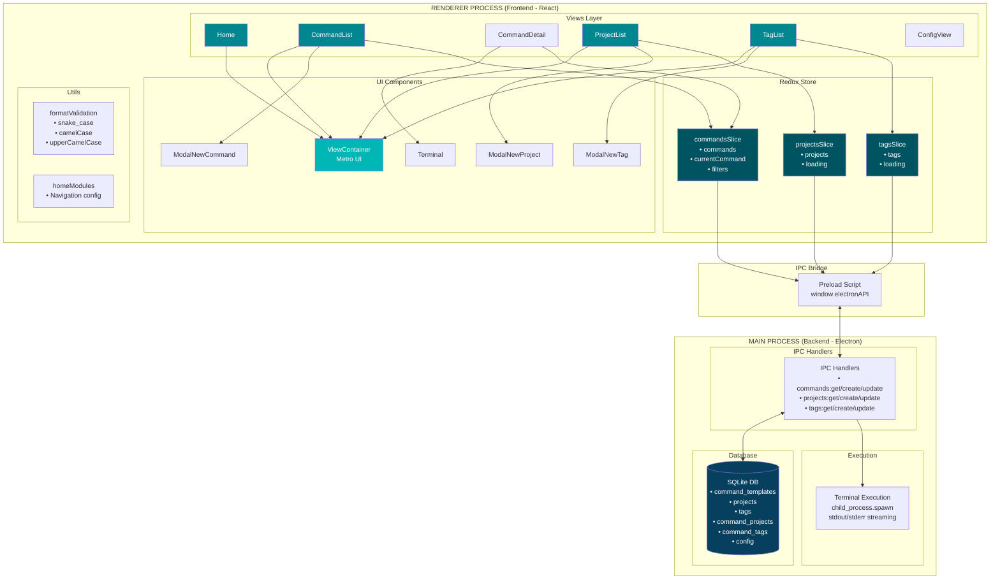
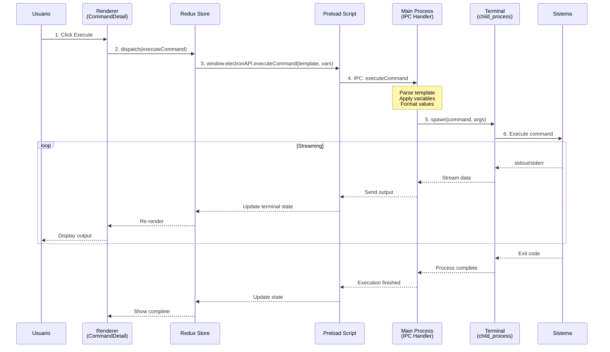
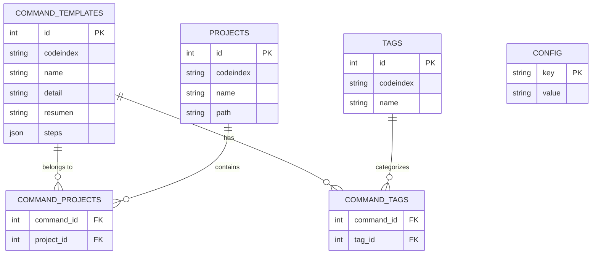
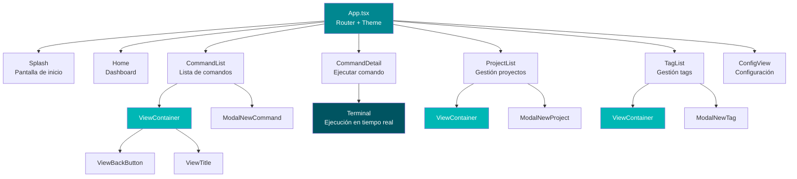

# Alice App

> 🚧 **PROYECTO EN CONSTRUCCIÓN** - Este proyecto está actualmente en desarrollo activo. Algunas funcionalidades pueden estar incompletas o sujetas a cambios.

**Proyecto Personal** | Un gestor visual de plantillas de comandos para desarrolladores

Alice App es una aplicación de escritorio basada en Electron diseñada para resolver un problema común en el desarrollo de software: **la gestión, estandarización y ejecución segura de comandos CLI complejos y repetitivos**. Permite crear plantillas con variables controladas mediante selectores, limitando las opciones disponibles y asegurando la consistencia en los comandos ejecutados por todo el equipo.

## El Problema

Los desarrolladores frecuentemente ejecutan comandos largos y complejos que requieren múltiples parámetros, nombres de archivos específicos, y convenciones de formato (camelCase, snake_case, etc.). Estos comandos son propensos a errores tipográficos, difíciles de recordar, complicados de compartir con el equipo, y **carecen de estandarización**, lo que resulta en comandos ejecutados de manera inconsistente entre diferentes miembros del equipo.

## La Solución

Alice App proporciona una interfaz visual intuitiva donde puedes:

- **Crear plantillas estandarizadas** de comandos con variables parametrizadas
- **Controlar las opciones** mediante selectores dropdown que limitan valores a opciones predefinidas
- **Validar formatos automáticamente** (snake_case, camelCase, etc.) antes de la ejecución
- **Garantizar consistencia** en todos los comandos ejecutados por el equipo
- Ejecutar comandos con un terminal integrado que muestra el output en tiempo real
- Organizar comandos por proyectos y etiquetas para fácil acceso
- Compartir plantillas estandarizadas con tu equipo mediante archivos JSON

En lugar de memorizar `rails g migration AddUsernameTo{{TableName}} username:string:uniq`, simplemente seleccionas la plantilla y completas los campos en un formulario visual.

## Características

- **Gestión de Plantillas de Comandos**: Crea, edita y organiza plantillas de comandos
- **Entrada Visual de Variables**: Completa variables de comandos mediante una interfaz amigable
- **Terminal Integrada**: Ejecuta comandos y visualiza la salida en tiempo real
- **Gestión de Proyectos**: Organiza comandos por proyectos con rutas de ejecución específicas
- **Sistema de Etiquetas**: Categoriza y filtra comandos usando etiquetas
- **Validación de Formatos**: Formateo automático para variables (snake_case, camelCase, upperCamelCase, etc.)
- **Importación/Exportación JSON**: Comparte plantillas de comandos entre equipos usando archivos JSON
- **Base de Datos SQLite**: Almacenamiento local rápido y confiable

## Stack Tecnológico


- **Electron Forge** - Framework para aplicaciones de escritorio
- **React** - Librería de UI con React Router para navegación
- **Redux Toolkit** - Gestión de estado
- **Material-UI (MUI)** - Librería de componentes
- **TypeScript** - Tipado estático
- **SQLite** - Base de datos local
- **SASS (SCSS)** - Estilos con metodología BEM

## Comenzando

### Instalación

1. Instalar dependencias:

```bash
npm install
```

### Desarrollo

Ejecutar la aplicación en modo desarrollo:
```bash
npm start
```

### Compilación

Compilar la aplicación para producción:
```bash
npm run make
```

## Estructura del Proyecto

```
alice-app/
├── src/
│   ├── main/
│   │   ├── database/
│   │   │   ├── index.ts              # Inicialización de base de datos
│   │   │   └── schema.sql            # Esquema de base de datos
│   │   └── services/
│   │       └── ipcHandlers.ts        # Manejadores de comunicación IPC
│   ├── renderer/
│   │   ├── components/
│   │   │   ├── ModalNewCommand.tsx   # Modal de creación de comandos
│   │   │   ├── ModalNewProject.tsx   # Modal de creación de proyectos
│   │   │   ├── ModalNewTag.tsx       # Modal de creación de etiquetas
│   │   │   └── Terminal.tsx          # Componente de terminal
│   │   ├── views/
│   │   │   ├── CommandList.tsx       # Vista de lista de comandos
│   │   │   ├── CommandList.scss      # Estilos de lista de comandos
│   │   │   ├── CommandDetail.tsx     # Vista de ejecución de comandos
│   │   │   ├── ProjectList.tsx       # Gestión de proyectos
│   │   │   ├── TagList.tsx           # Gestión de etiquetas
│   │   │   ├── TagList.scss          # Estilos de etiquetas
│   │   │   ├── ConfigView.tsx        # Vista de configuración
│   │   │   ├── Home.tsx              # Dashboard principal
│   │   │   └── Splash.tsx            # Pantalla de inicio
│   │   ├── ui/
│   │   │   ├── ViewContainer.tsx     # Contenedor de vista estilo Metro
│   │   │   ├── ViewContainer.scss    # Estilos del contenedor
│   │   │   ├── ViewBackButton.tsx    # Botón de navegación atrás
│   │   │   └── ViewTitle.tsx         # Componente de título de página
│   │   ├── store/
│   │   │   ├── index.ts              # Configuración de Redux store
│   │   │   ├── hooks.ts              # Hooks tipados de Redux
│   │   │   ├── commandsSlice.ts      # Estado de comandos
│   │   │   ├── projectsSlice.ts      # Estado de proyectos
│   │   │   └── tagsSlice.ts          # Estado de etiquetas
│   │   ├── types/
│   │   │   └── index.ts              # Definiciones de tipos TypeScript
│   │   ├── utils/
│   │   │   ├── formatValidation.ts   # Funciones de validación de formato
│   │   │   └── homeModules.tsx       # Configuración de módulos del home
│   │   └── App.tsx                   # Componente principal de React con routing
│   ├── index.ts                      # Proceso principal de Electron
│   ├── preload.ts                    # Script de preload (puente IPC)
│   └── renderer.ts                   # Punto de entrada de React
├── webpack.main.config.ts            # Configuración de Webpack para main
├── webpack.renderer.config.ts        # Configuración de Webpack para renderer
├── webpack.plugins.ts                # Plugins de Webpack
├── tsconfig.json                     # Configuración de TypeScript
├── example-config.json               # Archivo de configuración de ejemplo
└── package.json                      # Dependencias y scripts
```

## Arquitectura

### Patrón de Diseño

- **BEM (Block Element Modifier)** para nomenclatura de clases SCSS
- **Diseño Metro/Outlook** para componentes UI (botones grandes, interfaz minimalista)
- **Arquitectura basada en componentes** con separación de responsabilidades

### Alias de Rutas

- `@/` - src/
- `@main/` - src/main/
- `@renderer/` - src/renderer/
- `@components/` - src/renderer/components/
- `@views/` - src/renderer/views/
- `@store/` - src/renderer/store/
- `@types/` - src/renderer/types/
- `@utils/` - src/renderer/utils/
- `@ui/` - src/renderer/ui/

### Paleta de Colores

- Primary Dark: `#005461`
- Primary Main: `#018790`
- Primary Light: `#00B7B5`
- Background: `#F4F4F4`

## Uso

### Pantalla Principal

La pantalla principal proporciona acceso a cuatro secciones principales:

- **Commands**: Navegar y ejecutar plantillas de comandos
- **Projects**: Gestionar configuraciones de proyectos
- **Tags**: Organizar etiquetas para filtrado
- **Config**: Configurar ajustes de la aplicación

### Crear una Plantilla de Comando

1. Navegar a **Commands**
2. Hacer clic en **Add Command**
3. Completar:
   - Name (nombre)
   - Detail (explicación completa)
   - Resumen (resumen breve)
   - Tags (para filtrado)
   - Projects (opcional, dónde ejecutar)
   - Steps con variables

### Tipos de Variables

- **string**: Entrada de texto libre con formato opcional
- **option**: Selección dropdown de opciones predefinidas
- **number**: Entrada numérica
- **boolean**: Selección verdadero/falso

### Formatos de Variables

- `snake_case`: minúsculas_con_guiones_bajos
- `camelCase`: primeraPalabraMinúsculaRestoCapitalizado
- `upperCamelCase`: TodasPalabrasCapitalizadas
- `kebab-case`: minúsculas-con-guiones
- `UPPER_CASE`: MAYÚSCULAS_CON_GUIONES_BAJOS

### Configuración JSON

Consulta `example-config.json` para ver la estructura. Puedes:

1. Crear archivos JSON con plantillas de comandos
2. Importarlos vía **Config** → **Import JSON**
3. Exportar tu base de datos a JSON vía **Config** → **Export to JSON**

### Ejemplo de Plantilla de Comando

```json
{
  "codeindex": "unique-id",
  "name": "Add Migration",
  "detail": "Explicación larga de lo que hace esto",
  "resumen": "Resumen corto",
  "project": ["project-codeindex-1"],
  "tags": ["migration", "rails"],
  "steps": [
    {
      "name": "Generate Migration",
      "detail": "Crea el archivo de migración",
      "command": "rails g migration Add{{fieldName}}To{{tableName}} {{field_name}}:{{fieldType}}",
      "variables": [
        {
          "name": "fieldName",
          "type": "string",
          "detail": "Nombre del campo en UpperCamelCase",
          "format": "upperCamelCase"
        },
        {
          "name": "tableName",
          "type": "string",
          "detail": "Nombre de la tabla en UpperCamelCase",
          "format": "upperCamelCase"
        },
        {
          "name": "field_name",
          "type": "string",
          "detail": "Nombre del campo en snake_case",
          "format": "snake_case"
        },
        {
          "name": "fieldType",
          "type": "option",
          "detail": "Tipo de columna",
          "options": ["string", "integer", "boolean"]
        }
      ]
    }
  ]
}
```

## Base de Datos

La aplicación usa SQLite para almacenamiento local. La base de datos se crea automáticamente en el directorio de datos de la aplicación del usuario.

Tablas:

- `projects` - Configuraciones de proyectos
- `tags` - Etiquetas disponibles
- `command_templates` - Plantillas de comandos
- `command_projects` - Relación muchos a muchos
- `command_tags` - Relación muchos a muchos
- `config` - Configuración de la aplicación

## Guía de Desarrollo

### Agregar una Nueva Vista

1. Crear un nuevo componente en `src/renderer/views/`
2. Agregar la ruta en `src/renderer/App.tsx`
3. Actualizar la navegación según sea necesario
4. Usar el componente `ViewContainer` para un diseño Metro consistente

### Agregar un Nuevo Manejador IPC

1. Agregar el manejador en `src/main/services/ipcHandlers.ts`
2. Exponerlo en `src/preload.ts`
3. Usarlo en tus componentes React vía `window.electronAPI`

### Convenciones de Nomenclatura

- **Vistas**: Forma singular (ej. `CommandList`, `ProjectList`, `TagList`)
- **Componentes**: Nombres descriptivos (ej. `ModalNewCommand`, `ViewContainer`)
- **SCSS**: Metodología BEM (ej. `.command-list__filters`)

## Esquema del Sistema

### Arquitectura General



### Flujo de Datos: Ejecución de Comando



### Modelo de Datos



### Estructura de Componentes React



## Licencia

MIT

## Contribuir

¡Las contribuciones son bienvenidas! Por favor, siéntete libre de enviar un Pull Request.
